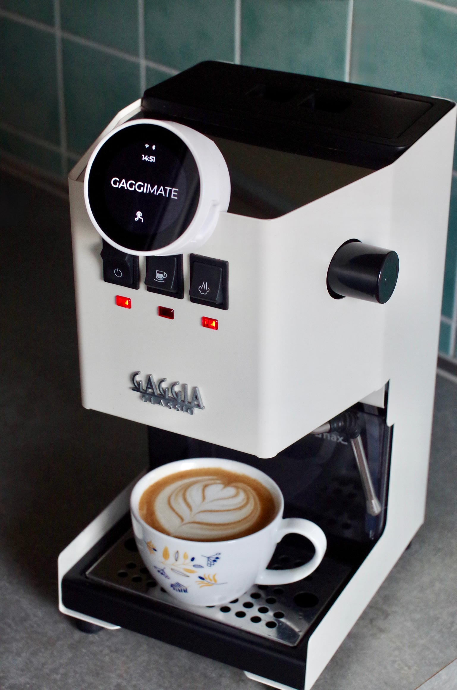
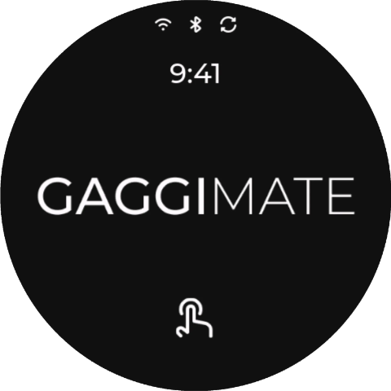
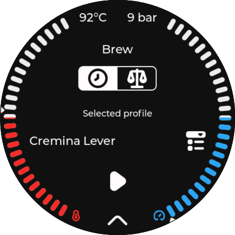
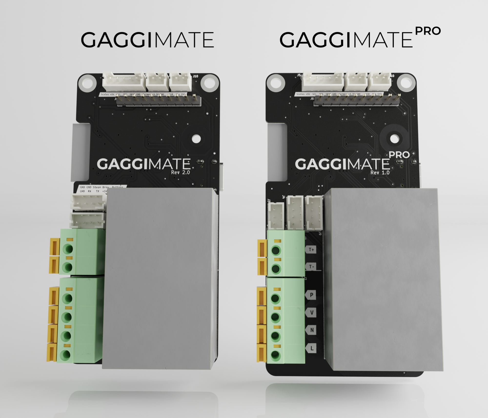

 
  

[![CC BY-NC-SA 4.0][cc-by-nc-sa-shield]][cc-by-nc-sa]
[![Sonar QG][sonar-shield]][sonar-url]
[![Sonar Violations][sonar-violations]][sonar-url]
[![Sonar Tech Debt][sonar-tech-debt]][sonar-url]

This project upgrades a Gaggia espresso machine with smart controls to improve your coffee-making experience. By adding a display and custom electronics, you can monitor and control the machine more easily.

## Features

- **Temperature Control**: Monitor the boiler temperature to ensure optimal brewing conditions.
- **Brew timer**: Set a target duration and run the brewing for the specific time.
- **Steam and Hot Water mode**: Control the pump and valve to run the respective task.
- **Safety Features**: Automatic shutoff if the system becomes unresponsive or overheats.
- **User Interface**: Simple, intuitive display to control and monitor the machine.

## Screenshots and Images

### How to buy

You can buy your kit on https://shop.gaggimate.eu/

## How It Works

The display allows you to control the espresso machine and see live temperature updates. If the machine becomes unresponsive or the temperature goes too high, it will automatically turn off for safety.

## Docs

The docs were moved to [https://gaggimate.eu/](https://gaggimate.eu/). You can find all sourcing and assembly information there.
Additional documentation for the WebSocket API can be found in [docs/websocket-api.yaml](docs/websocket-api.yaml).

## License

This work is licensed under CC BY-NC-SA 4.0. To view a copy of this license, visit https://creativecommons.org/licenses/by-nc-sa/4.0/

[sonar-violations]: https://img.shields.io/sonar/blocker_violations/jniebuhr_gaggimate?server=https%3A%2F%2Fsonarcloud.io&style=for-the-badge
[sonar-shield]: https://img.shields.io/sonar/quality_gate/jniebuhr_gaggimate?server=https%3A%2F%2Fsonarcloud.io&style=for-the-badge
[sonar-tech-debt]: https://img.shields.io/sonar/tech_debt/jniebuhr_gaggimate?server=https%3A%2F%2Fsonarcloud.io&style=for-the-badge
[sonar-url]: https://sonarcloud.io/project/overview?id=jniebuhr_gaggimate
[cc-by-nc-sa]: http://creativecommons.org/licenses/by-nc-sa/4.0/
[cc-by-nc-sa-image]: https://licensebuttons.net/l/by-nc-sa/4.0/88x31.png
[cc-by-nc-sa-shield]: https://img.shields.io/badge/License-CC%20BY--NC--SA%204.0-lightgrey.svg?style=for-the-badge

---

## 本地改动 & 实施计划（dmq1219 自用 fork，非官方）

> **完整接手以根目录 [`HANDOFF.md`](HANDOFF.md) 为准(唯一交接入口)。** 本节是协作过程的本地改动记录 / 快速回顾。

### 已完成
- 显示屏：无 Wi-Fi（AP 模式）也能自动休眠 + CST820 触摸唤醒（去掉 AP 对休眠的拦截）。
- 显示屏：待机电池 ⚡ + 百分比显示（Montserrat 20；原先放大到 42，后按要求缩小一半）。
- 显示屏：开机/待机画面用「咖啡豆抛接」动画替换 GaggiMate logo（居中、~半屏）。素材 6 帧 PNG → 抠浅灰底、合成到深色背景 `0x131313` → 240×228 循环 GIF（~44KB）→ 内嵌 `ui_img_coffee_anim.c`（`lv_img_dsc` cf=RAW）；开启 `LV_USE_GIF`，`ui_StandbyScreen` 的 logo 改用 `lv_gif`。改 `lv_conf` 后照例需删 `.pio/build/display/libb3a/lvgl` 重编。
- 误刷 controller 固件导致的黑屏 → 已救回；controller 用同仓库固件刷齐 `PROTOCOL_VERSION=3`。
- 恢复 5 个冲煮 profile（9bar / Adaptive v2 / Cremina lever / Damian's LM Leva / Backflush）；无秤版：出液停止条件由「克数(volumetric)」改为「泵水量(pumped ml)」。

### 已完成：修复网页 UI 白屏（真根因 = 固件嵌入了「空壳」网页包）
**真根因**：固件里嵌入的网页包 `gWebUiBlobStart` 只有 **1 字节**（应为 437,748）。因为 PlatformIO/SCons **不追踪 `.incbin` 依赖**：`web_ui_blob.S.o` 在 `embed_webui_pre.py` 写的空占位阶段编过一次后，`build_webui.sh` 生成真包时 `.S` 文本没变 → `.o` 没重编 → 固件一直嵌着 1 字节空壳。`serveWebAsset` 按清单偏移读 → 读到隔壁 flash 的垃圾 → 浏览器 `ERR_CONTENT_DECODING_FAILED` → 白屏。**网页包/服务器/传输本身都没问题**（早先「热点截断」的判断是错的）。AP 配网页与网页 UI 同一套，所以一起白屏、也一起修好。

**修复**：
1. 删除陈旧的 `web_ui_blob.S.o` 并重编 → 真包(437KB)正确嵌入（`gWebUiBlobEnd - gWebUiBlobStart` 现为 437748）。从 Mac 抓入口 JS，**md5 与原始包逐字节一致**；浏览器实测正常打开。
2. 永久防回归：`scripts/embed_webui.py` 在生成的 `web_ui_blob.S` 注释里写入包的「大小 + sha256 指纹」 → 包一变 `.S` 文本就变 → 强制重编 `.o`，不会再嵌空壳。
3. 直连家庭 Wi-Fi（STA）：一次性在 `Controller::connect()` 写入凭据连上家庭网络（IP `192.168.0.x`）；凭据持久化到 NVS 后**已从源码移除明文密码**。
4. 标准待机 10 分钟：通过 `/api/settings` 接口直接设置（`standbyTimeout=600`），未改设备代码。

**回退**：整片 16MB 备份 `display_flash_backup.bin` 可随时还原。

> 注意：显示屏在「没连 controller」时约 2 分钟自动深睡、会断 WiFi（点屏只能唤醒重启、不能阻止睡）。正常用（controller 连着 / 机器开着）不睡，网页随时可达。
