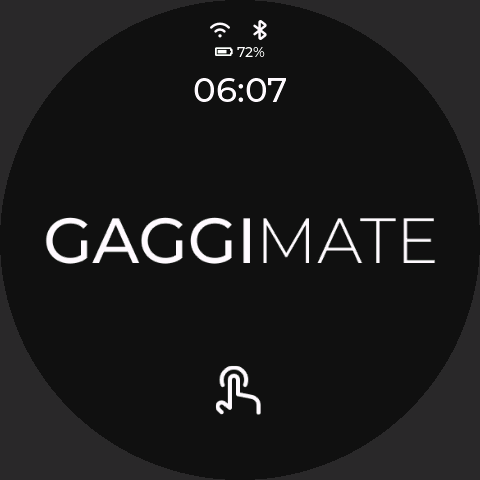
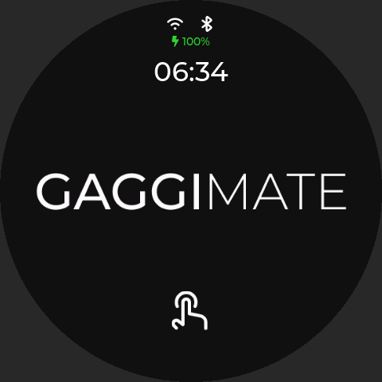
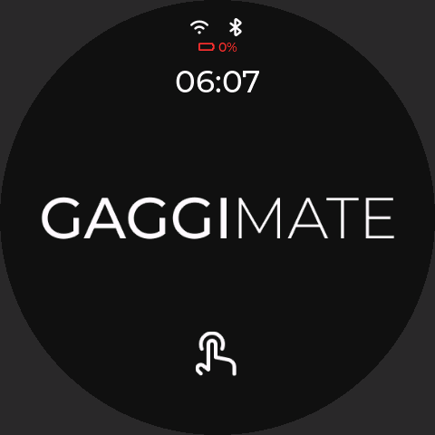

# Display: no-controller auto-sleep + battery indicator

**Scope: display firmware only (LilyGo T-RGB, `env:display`).**
No changes to the controller firmware, coffee-control logic (heater/pump/valve/pressure/
temperature), profile schema/engine, BLE control commands, bootloader, partition table,
eFuse, Secure Boot, or Flash Encryption.

Base: forked from `jniebuhr/gaggimate` upstream `master` @ `591abe74`.

---

## Goals

1. **Auto-sleep when no controller** — if the display has no BLE connection to the
   GaggiMate Controller (PCB) for **120 s**, it enters deep sleep to save battery. It
   wakes on **touch** (the chip reboots and re-scans for the controller).
2. **Battery indicator** — show the single-cell 3.7 V Li-ion state (approx. percentage
   **and** voltage) on the display.
3. **Official firmware stays recoverable** — no bootloader/partition/flash-security
   changes; re-flash the official build to revert.

---

## What changed (display-only)

| File | Change |
|------|--------|
| `src/display/core/constants.h` | Auto-sleep + battery default constants |
| `src/display/drivers/Driver.h` | Add `sleep()`, `hasBattery()`, `getBatteryMilliVolts()` (default no-op / 0) |
| `src/display/drivers/LilyGoDriver.h` | Implement them via `panel.enableTouchWakeup()/sleep()` and `panel.getBattVoltage()` |
| `src/display/core/AutoSleepManager.h` | New pure-logic module: no-controller sleep policy |
| `src/display/core/BatteryMonitor.h` | New pure-logic module: voltage → approx. % (piecewise LUT) |
| `src/display/core/Settings.{h,cpp}` | `autoSleepNoController` (default on) + `noControllerSleepTimeout` (default 120 s) |
| `src/display/plugins/WebUIPlugin.cpp` | Read/serialize the two new settings (checkbox uses the `hasArg` presence convention, like `clock24hFormat`) |
| `web/src/pages/Settings/index.jsx` | Display Settings → **Auto Sleep**: enable toggle + timeout (s) input |
| `src/display/ui/default/DefaultUI.{h,cpp}` | Drive both managers; battery overlay on the LVGL top layer |
| `sim/driver/SdlDriver.h` | Mock battery (`GM_SIM_BATTERY_MV`, default 3900) + mock sleep (logs, never exits) |

No new BLE commands. The display only **reads** BLE connection state and **never**
sends standby/brew/stop/valve/pump/heater commands before sleeping.

---

## Behaviour

### Auto-sleep (`AutoSleepManager`)
- Countdown starts at boot and whenever the controller disconnects.
- Reconnect within the timeout cancels it.
- Touch resets the UI idle timer but does **not** block the no-controller countdown.
- Suppressed during OTA / firmware update / Wi-Fi AP setup / autotune.
- If the battery is **critical** (< 3400 mV) and no controller, it sleeps after ¼ of the timeout.
- Configurable in the **Web UI**: *Settings → Display Settings → Auto Sleep* (enable toggle +
  timeout in seconds), backed by `Settings.autoSleepNoController` / `noControllerSleepTimeout`.
  Compile-time defaults live in `constants.h`.

### Wake behaviour
- The LilyGo T-RGB display enters ESP32-S3 deep sleep with touch IRQ configured as
  the wake source (`panel.enableTouchWakeup(); panel.sleep();`).
- Touch wake does **not** mean the main CPU keeps polling the touch panel. In deep
  sleep, the CPU/BLE/Wi-Fi/LVGL are stopped; only the low-power wake circuitry and
  touch interrupt path remain active.
- A wake from deep sleep is a reboot. The display firmware starts fresh and scans
  for the controller again.
- The controller cannot wake a sleeping display over BLE because BLE is off during
  deep sleep. If the display is already asleep, the user must touch it to wake it.
- A future timer-wake mode could periodically wake, scan for the controller, and go
  back to sleep, but that is intentionally not part of this display-only touch-wake
  implementation because it increases battery use.

### Battery (`BatteryMonitor`)
- Sampled every 30 s via `Driver::getBatteryMilliVolts()` → on the T-RGB this is
  `panel.getBattVoltage()`, which averages ~20 ADC reads on `BOARD_ADC_DET` (GPIO4) and
  already accounts for the on-board 1/2 divider.
- Percentage is an **approximation** (coarse Li-ion LUT, 3400 mV = 0 %, 4200 mV = 100 %).
  Only the **percentage** is shown (no voltage), on a small overlay on the LVGL top layer:
  `<icon> NN%`, white normally, amber < 3500 mV, red < 3400 mV.
- **Charging / USB:** the T-RGB has no charge-status pin, so charging is *inferred* — while
  USB is plugged the reading tracks the charging voltage (≥ `BATTERY_CHARGING_MV` = 4200 mV
  once it tops off). In that case the overlay shows a **charging bolt + percentage**
  (`⚡ NN%`, green) — the bolt distinguishes charging from on-battery, while the percentage
  (charging-voltage based, so it trends toward ~100 %) is still visible.

> **USB caveat:** because there is no charge-status pin, "charging" is a voltage heuristic, not
> a true charge signal: a battery genuinely at 100 % reads the same as one being charged. The
> reading is meaningful as a *percentage* only on battery power.

### Screenshots (from the simulator)

Top-centre overlay, inside the round panel — percentage only on battery, charging
indicator on USB:

| Normal (`GM_SIM_BATTERY_MV=3950`) | Charging / USB (`=4250`) | Critical (`=3380`) |
|---|---|---|
|  |  |  |

Captured headlessly with `./.pio/build/display-sim/program --screenshot shot.bmp 4500`.
The "starting / waiting-for-controller" view uses the same standby screen, so the overlay
appears there too.

---

## Build / test

> Note: PlatformIO's `display-sim` env breaks if the project path contains a **space**
> (unquoted `-I ${PROJECT_DIR}/sim/...` flags). Build the sim from a space-free path.
> The device `display` env builds fine regardless. The build scripts need **Python 3.11+**
> (`datetime.UTC`).

```bash
# Device firmware
pio run -e display

# Static analysis
pio check -e display

# Simulator (from a path without spaces)
pio run -e display-sim -t run
# simulate battery levels:
GM_SIM_BATTERY_MV=3400 pio run -e display-sim -t run
# format
scripts/format.sh
```

### Manual test checklist (real T-RGB)
1. Display on battery, controller off → "waiting", battery visible, **sleeps after 120 s**, wakes on touch.
2. Controller turned on within 120 s → connects, does **not** sleep.
3. Connected, then controller off → "waiting", sleeps after 120 s.
4. Controller back within 120 s → does **not** sleep.
5. USB to a PC → flashes, serial logs OK; auto-sleep can be disabled via the setting while debugging.
6. Simulator → mock battery visible; `[sim] AutoSleep: enterDisplaySleep() (mock, not sleeping)` logged instead of exiting.

### Hardware test record (fill in on a real T-RGB)

| # | Scenario | Expected | Result (PASS/FAIL + notes) |
|---|----------|----------|----------------------------|
| 1 | Battery power, controller off | Sleeps ~120 s after boot | **PASS** — verified via a 15 s test build (USB-CDC port dropped = deep sleep, screen black) |
| 2 | Battery power, touch the sleeping screen | Wakes (reboots), re-scans BLE | **PASS** — touch woke the CST820 panel and the board rebooted |
| 3 | Controller turned on within 120 s | Connects, does **not** sleep | _todo_ |
| 4 | Connected, then controller off | Sleeps ~120 s after disconnect | _todo_ |
| 5 | Controller back within 120 s of disconnect | Does **not** sleep | _todo_ |
| 6 | Display asleep, then controller powered on | Display stays asleep until touched; no BLE wake | _todo_ |
| 7 | Battery in, then plug USB-C charger | Overlay shows **⚡ NN%** (charging bolt + percentage) | _todo_ |
| 8 | Battery overlay on battery power | Approx **% only** (no voltage); amber < 3.5 V, red < 3.4 V | _todo_ |

> Status: core path **verified on a real LilyGo T-RGB** (touch IC: **CST820**) — no-controller
> deep sleep and **touch wake** both work (items 1–2). Builds (display + display-sim), static
> check (space-free path) and web UI all pass. Items 3–8 remain to confirm with a controller
> and on battery power.

---

## Recovery

Auto-sleep is a setting (default on) — turn it off in the web config to disable. To fully
revert, re-flash the official display firmware from <https://docs.gaggimate.eu/docs/flashing/>.
Nothing in bootloader / partitions / flash security is touched.
